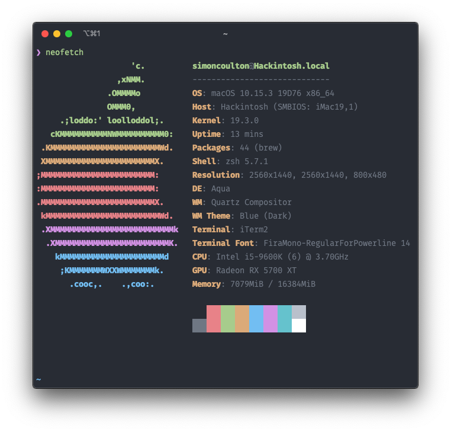

# OpenCore Bootloader Hackintosh

Guide used [OpenCore Vanilla](https://khronokernel.github.io/Opencore-Vanilla-Desktop-Guide/), I highly suggest reading through all of it and going through and creating your own `config.plist` even if it's just to understand the inner workings of OpenCore. Directly copying my `config.plist` may not work if you do not have the exact components that I do.

This has been tested and is running on 10.15.4 (with the supplemental update).

## Updates

| Date       | Updates                                                        |
| :--------- | :------------------------------------------------------------- |
| 30/04/2020 | Updated to April OC release, include OpenCanopy, updated kexts |

## Hardware

| Name        | Value                   |
| :---------- | :---------------------- |
| CPU         | Intel i5-9600k @ 3.7GHz |
| GPU         | Radeon RX 5700 XT       |
| Motherboard | ASUS ROG STRIX Z390-I   |
| Case        | NZXT H200i              |

## Working

- iServices
- Audio
- Networking (no airport or WIFI, haven't replaced the onboard card)

### USB Port Mapping

## Kexts

### Generic

- Lilu.kext
- WhateverGreen.kext
- VirtualSMC.kext
- SMCProcessor.kext
- SMCSuperIO.kext
- AppleALC.kext
- USBInjectAll.kext (disabled)

### System specific

- IntelMausiEthernet.kext

### Custom

You should generate these yourself if you're not using my exact component list.

- USBPorts.kext (generate by using USBInjectAll.kext and Hackintool)

## ACPI

### System specific

- SSDT-PLUG.aml
- SSDT-EC-USBX.aml
- SSDT-AWAC.aml
- SSDT-PMC.aml

### Custom

- FixShutdown-USB-SSDT.aml
- SSDT-HPET.aml (generated via your own DSDT.dsl file)
- SSDT-UIAC.aml (USB Port mapping, generated via Hackintool along side USBPorts.kext)

## Tools

- Hackintool
- PlistEdit Pro (VS Code works just as well, but PlistEdit Pro is probably more user friendly)
- The following from Corpnewt
  - SSDTTime
  - MountEFI
  - gibMacOS
  - FixHPET

## Gotchas & Troubleshooting

1. `agdpmod=pikera` is required in NVRAM > Add > 7C436110-AB2A-4BBB-A880-FE41995C9F82 > boot-args, otherwise you'll get a black screen.
2. The system will throw an error regarding POST on every reboot unless `SAT0 to SATA`, `_Q11 to XQ11` and `_Q12 to XQ12` are included in ACPI > Patch.
3. If you need to generate a .aml file, use `$ ./iasl <path to .dsl>`, this tool is located in the `Scripts` folder when you run any of CorpNewts tools (MountEFI is probably the first one you'll use).
4. Generating your own systems `DSDT.aml` (used as the basis for any of your custom SSDT files) file is best done in Windows using CorpNewts SSDTTime tool.
